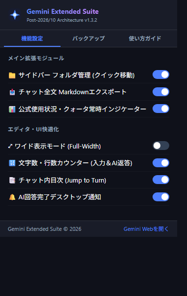
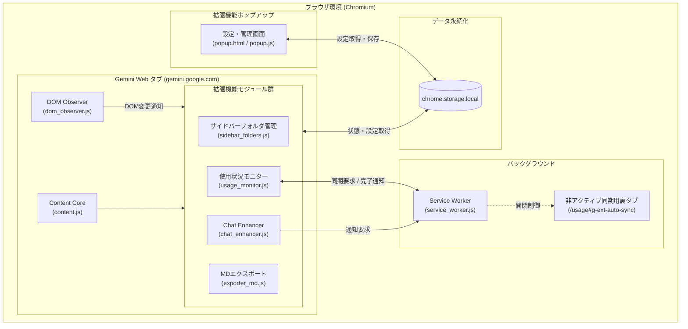

# Gemini Extended Suite (Manifest V3)

<div align="center">


**Gemini Web UI 向け 包括的作業支援ブラウザ拡張機能**

[](https://developer.chrome.com/docs/extensions/mv3/intro/)
[](manifest.json)
[](https://gemini.google.com)
[](#)

</div>

---

> [!WARNING]
> **ご注意 / お願い**
> 本リポジトリは自分用のお試しプロジェクト（WIP）です。不具合や未実装機能が多数含まれています。

## 1. プロジェクト概要

**Gemini Extended Suite** は、Google の AI サービス「Gemini Web インターフェース（`https://gemini.google.com`）」におけるクリエイティブワーク、長編小説・シナリオ執筆、プログラミング、学術リサーチを飛躍的に快適化するオールインワンのブラウザ拡張機能（Manifest V3 準拠）です。

Gemini の頻繁な UI 更新や SPA（Single Page Application）の非同期 DOM レンダリングに追従する自己修復型 DOM Observer を核とし、スレッドのフォルダ階層整理、高品質な思考プロセス（Thinking）付き Markdown エクスポート、公式使用制限（`/usage`）のリアルタイム監視、目次ジャンプ、入力および返答のリアルタイム文字数カウントなどの先進的な機能を提供します。

---

## 2. UI プレビュー & スクリーンショット

### ポップアップ管理画面 (Popup Interface)
拡張機能アイコンをクリックすることで、各機能の有効/無効のワンクリック切り替え、フォルダ構成・設定の JSON バックアップ/リストアが可能です。

<div align="center">



</div>

---

## 3. システムアーキテクチャ & 設計仕様

本拡張機能は Google Chrome および Chromium 系ブラウザ（Microsoft Edge 等）の最新仕様である **Manifest V3** に完全準拠しています。



### アーキテクチャ設計原則
1. **完全ローカル完結型 (Zero External Telemetry)**
   - ユーザーのチャット内容、プロンプト、アカウント情報が外部サーバーへ送信されることは一切ありません。すべてのデータはブラウザの `chrome.storage.local` に安全に保管されます。
2. **自己位置修復型 DOM マウント (Resilient DOM Observer)**
   - Gemini Web の高速な非同期ロードや F5 リロード時にも、競合（レースコンディション）を回避してサイドバー上部やチャットヘッダーに要素を安全に再マウントします。
3. **裏タブ非同期同期方式 (Safe Hidden Tab Auto-Sync)**
   - クロスオリジン制約や iframe 埋め込み時の `DOMException` を完全根絶するため、Service Worker 経由で非アクティブな裏タブを一時起動し、公式使用量データをスクレイピング後、即座にクローズする安全な同期フローを採用しています。

---

## 4. 詳細機能仕様

### ① サイドバー フォルダ管理 (`sidebar_folders.js`)
- **フォルダ分類**: サイドバー上部に「＋ 新規フォルダ」ボタンを追加。
- **ワンクリック移動**: 各スレッド項目のホバーメニューに「📁」ボタンを配置。クリックでポップオーバーが開き、指定フォルダへ即座に移動。
- **ドラッグ＆ドロップ**: スレッドをフォルダヘッダーへドラッグ＆ドロップすることでも移動可能。
- **アコーディオン開閉**: フォルダごとにスレッド群の展開/折りたたみが可能。開閉状態は自動保存。
- **タイトル完全永続化**: Gemini 側の非同期更新によるスレッドタイトルの上書きバグを防止し、カスタム命名を維持。

### ② Markdown 全文エクスポート (`exporter_md.js`)
- **ワンクリック保存**: 画面右上ツールバーに「📥 MD保存」ボタンを注入。
- **思考プロセス（Thinking）抽出**: Gemini の Thinking（折りたたみ思考ログ）を含む/除外するトグルに対応。
- **構文抽出の最適化**:
  - コードブロック（言語名ラベル、インデントの完全保持）
  - テーブル（Markdown 表形式への整形）
  - 引用、リスト、数式ブロックの正規化
- **YAML フロントマター**:
  - タイトル、エクスポート日時、URL、メッセージ数、Thinkingの有無を YAML ヘッダーとして自動付加。
- **ファイル名サニタイズ**: OS 依存の禁止文字（`\ / : * ? " < > |`）を安全に置換。

### ③ 公式使用状況・クォータ常時インジケーター (`usage_monitor.js`)
- **公式連携**: `https://gemini.google.com/usage` から正確なリアルタイムデータを取得。
- **視認性の高いインジケーター**:
  - 画面ヘッダーに使用状況バーを常時表示。
  - 現在のメッセージ使用数 / 上限、リセットまでの残り時間、1週間の上限使用率を表示。
  - 残り使用量に応じてカラーが自動変化（安全: 緑、注意: 黄、警戒: 赤）。
- **詳細ポップオーバー**: クリック時にモデル別の使用枠やリセット時刻を一覧表示。

### ④ Chat Enhancer (`chat_enhancer.js`)
- **📑 チャット内目次 (Jump to Turn)**:
  - 会話が長くなっても、ユーザーの質問見出しを右端にフローティング目次として一覧化。
  - クリックで目的のターンへスムーズスクロール。
- **⤢ フルワイド表示モード (Full-Width Mode)**:
  - デフォルトの狭いチャット幅を解除し、大画面モニターで 85%〜100% のワイドレイアウトに切り替え。
- **🔢 リアルタイム文字数・行数カウンター**:
  - **入力エリア**: 入力中の文字数・行数をプロンプトボックス下部にリアルタイム表示。
  - **AI返答メッセージ**: 各返答フッターに、本文および思考プロセスの文字数をカウントして目立たず表示。
- **🔔 AI回答完了デスクトップ通知**:
  - 長文生成や深い思考（Thinking）中に別タブで作業していても、生成完了時に OS のデスクトップ通知でお知らせ。

### ⑤ ポップアップ設定 & バックアップ (`popup/`)
- **機能別トグル**: 利用シーンに合わせて各機能を個別に ON/OFF 可能。
- **JSON バックアップ & リストア**:
  - 整理したフォルダツリーや設定情報をワンクリックで `.json` ファイルとしてローカル保存。
  - PC 移行やブラウザプロファイルの再構築時にも即座に復元可能。

---

## 5. ファイル・ディレクトリ構成

```text
gemini-extended-suite/
├── .gitignore                      # 除外ファイル設定 (環境変数、node_modules、キャッシュ等)
├── manifest.json                   # Chrome拡張機能マニフェスト (Manifest V3)
├── README.md                       # 本仕様書
├── background/
│   └── service_worker.js          # 常駐 Service Worker (通知、裏タブ同期管理)
├── content/
│   ├── content.js                 # 各モジュールの統合エントリーポイント
│   ├── dom_observer.js            # 動的DOM監視 & レディ判定モジュール
│   ├── modules/
│   │   ├── chat_enhancer.js       # 目次、ワイド化、文字数カウント、通知
│   │   ├── exporter_md.js         # Markdown全文エクスポートエンジン
│   │   ├── sidebar_folders.js     # サイドバーのフォルダ整理モジュール
│   │   └── usage_monitor.js       # 公式/usage連携クォータモニター
│   └── styles/
│       ├── components.css         # フォルダUI、目次、エクスポートボタン等のスタイル
│       ├── injected_theme.css     # Gemini本体への注入テーマ微調整
│       └── main.css               # 全体共通レイアウト・ワイド化スタイル
├── icons/
│   ├── icon-16.png                # 拡張機能アイコン (16x16)
│   ├── icon-48.png                # 拡張機能アイコン (48x48)
│   └── icon-128.png               # 拡張機能アイコン (128x128)
├── popup/
│   ├── popup.html                 # 設定画面ポップアップ HTML
│   ├── popup.css                  # 設定画面スタイルシート
│   └── popup.js                   # 設定トグル・バックアップ/インポート制御
└── docs/
    └── screenshots/
        └── popup-features.png     # ポップアップ画面スクリーンショット
```

---

## 6. インストール・読み込み手順（開発者モード）

### Google Chrome または Microsoft Edge での導入

1. ブラウザを開き、拡張機能管理ページにアクセスします:
   - **Google Chrome**: アドレスバーに `chrome://extensions/` を入力
   - **Microsoft Edge**: アドレスバーに `edge://extensions/` を入力
2. 画面右上（または左メニュー）の **「デベロッパー モード（開発者モード）」** を有効にします。
3. **「パッケージ化されていない拡張機能を読み込む」**（Edge では「展開して読み込む」）をクリックします。
4. 本プロジェクトのルートフォルダ（`gemini-extended-suite`）を選択します。
5. ツールバーの拡張機能一覧からピン留めを行うと、アイコンからいつでも設定にアクセスできます。
6. `https://gemini.google.com` を開き（既に開いている場合は F5 で更新）、拡張機能が正常に適用されていることを確認してください。

---

## 7. バージョン履歴 (Changelog)

- **v1.3.2** (2026-10-04)
  - F5リロード時のレースコンディションによるサイドバーヘッダーへの誤爆マウントを根絶。自己位置修復と開閉連動ロジックを実装。
- **v1.3.1** (2026-10-04)
  - Gemini 返答メッセージのリアルタイム文字数カウント機能を追加（思考プロセスの内訳表示に対応）。
- **v1.3.0** (2026-10-04)
  - 使用状況ポップオーバーの1週間上限カラー統一。
  - スレッドタイトルの完全永続化（再読み込み後の名称リセットバグを解消）。
- **v1.2.0** (2026-10-04)
  - 1週間の上限パーセンテージ取得正規表現の改善。
  - 手動オープン時は自動クローズしない判別ロジックの実装。
- **v1.1.0** (2026-10-04)
  - iframe による DOMException を完全根絶し、Service Worker 管理の安全な裏タブ自動同期方式へ刷新。
- **v1.0.0** (2026-10-04)
  - 初回リリース（フォルダ管理、MDエクスポート、使用量モニター、UI快適化）。

---

## 8. ライセンス & プライバシー

- **ライセンス**: Private Repository
- **データプライバシー**: 
  本拡張機能はサードパーティの解析ツール、外部サーバー、広告ネットワーク等への通信を一切行いません。すべての個人データ・設定は利用者のブラウザ内（ローカルストレージ）のみで処理されます。
